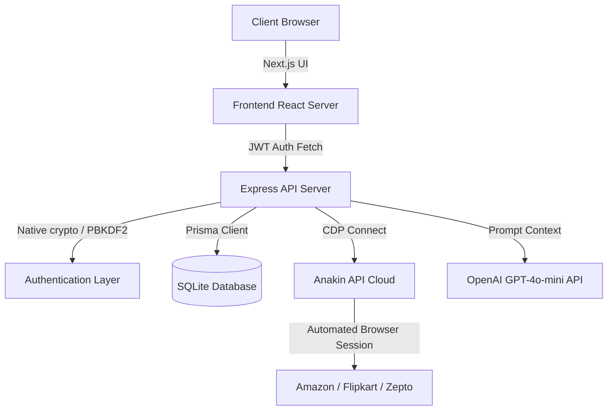

# 🛒 OrderHub

### *One ledger to rule all your orders, receipts, and returns.*

🚀 **Submission for the Anakin Hackathon**

---

## 📖 Table of Contents
* [⚠️ The Problem](#️-the-problem)
* [💡 The Solution](#-the-solution)
* [✨ Key Features](#-key-features)
* [🧬 System Architecture](#-system-architecture)
* [🛠️ Tech Stack](#️-tech-stack)
* [🚀 Getting Started](#-getting-started)
* [🔑 Anakin CDP Integration](#-anakin-cdp-integration)
* [🔮 Future Roadmap](#-future-roadmap)

---


## ⚠️ The Problem
* **Fragmented Purchases**: Checking what you ordered requires logging into 3+ different apps or checking cluttered email inboxes.
* **Return Window Disasters**: Missing return deadlines because dates are hidden deep inside order history detail pages.
* **Accounting Nightmares**: Searching for scattered invoices and PDF downloads during tax filing or expense reports.
* **Session Collisions**: Multi-user tools clash when attempting to scrape accounts simultaneously using generic browser identifiers.

---

## 💡 The Solution
OrderHub acts as your read-only order ledger. By connecting your e-commerce accounts securely through **Anakin CDP (Chrome DevTools Protocol) browser sessions**, it automates login validation and scrapes purchase details safely.

All transactions, invoices, items, and return dates are structured, categorized, and queryable in one localized ledger dashboard.

---

## ✨ Key Features

* **🛡️ Secure Multi-User Auth**: True user isolation. Signup, login, and profile fetching powered by native PBKDF2 password hashing and JWT validation.
* **👥 Isolated User Sessions**: Saved Anakin sessions are uniquely named `orderhub-<userId>-<platform>`, allowing multiple users to sync their accounts simultaneously without clashing.
* **📅 Custom Sync Ranges**: Sync your **Last 3 Months**, **Specific Calendar Years**, or your entire **Lifetime History (Last 6 Years)** at the click of a button.
* **📊 Brutalist Dashboard & Analytics**: Dynamic category mixtures, metric tracking, return notifications, and beautiful animated neo-brutalist charts.
* **💬 AI Ledger Assistant**: Ask questions like *"How much did I spend on groceries this month?"* or *"Show my Flipkart electronics orders"* and get instant summaries.
* **📥 CSV Export**: Single-click downloads of your entire unified order history database, pre-authorized using tokenized query strings.

---

## 🧬 System Architecture



---

## 🛠️ Tech Stack

* **Frontend**: Next.js 14 (App Router), TailwindCSS (Custom Brutalist Theme), Lucide Icons.
* **Backend**: Node.js, Express, JWT (`jsonwebtoken`), Native Crypto.
* **Database & ORM**: Prisma ORM, SQLite (Zero-docker local configuration).
* **Browser Automation**: Anakin API (`url-scraper` & CDP browser endpoints), Playwright-Core.
* **Artificial Intelligence**: OpenAI GPT-4o-mini.

---

## 🚀 Getting Started

### 1. Database Setup
Set up the Prisma Client and initialize the SQLite database locally:
```bash
cd backend
npm run prisma:generate
npm run prisma:push
```

### 2. Configure Environment Variables
Create the subfolder environmental files.

**Backend Env File ([/backend/.env](file:///C:/Users/ayush/Desktop/coding/Hackathon/Anakin/backend/.env)):**
```env
DATABASE_URL="file:./dev.db"
ANAKIN_API_KEY="your_api_key_here"
ANAKIN_API_BASE_URL="https://api.anakin.io"
OPENAI_API_KEY="optional_openai_key"
PORT=3001
AMAZON_EMAIL="your_amazon_email_for_CDP"
AMAZON_PASSWORD="your_amazon_password_for_CDP"
```

**Frontend Env File ([/frontend/.env.local](file:///C:/Users/ayush/Desktop/coding/Hackathon/Anakin/frontend/.env.local)):**
```env
NEXT_PUBLIC_API_URL="http://localhost:3001"
```

### 3. Run Development Servers
Open two terminal tabs:

**Start Backend (Port 3001):**
```bash
cd backend
npm run dev
```

**Start Frontend (Port 3000):**
```bash
cd frontend
npm run dev
```

Navigate to `http://localhost:3000` to register your account!

---

## 🔑 Anakin CDP Integration

### 1. Creating the Session
The tool includes a script to open a remote browser window inside Anakin, navigate to Amazon, and log in to save the browser cookies:
```bash
cd backend
npm run save:amazon-session
```
The script reads your `.env` credentials, navigates to Amazon, auto-fills login steps, and keeps the browser session alive until you complete any OTP verification. On browser disconnect, cookies are securely saved.

### 2. Extracting Purchase Data
The backend makes a headless scraping call to retrieve the order history page structure.
* Segments blocks cleanly using boundary conditions in [splitIntoOrderBlocks](file:///C:/Users/ayush/Desktop/coding/Hackathon/Anakin/backend/index.js#L800).
* Parses order metadata, item names, pricing, and invoices in [parseOrderBlock](file:///C:/Users/ayush/Desktop/coding/Hackathon/Anakin/backend/index.js#L821).

---

## 🔮 Future Roadmap
* **Auto-refresh Cron**: Run recurring cron jobs to pull order updates in the background.
* **Mailbox Scraper Integration**: Sync offline receipts from email inboxes using IMAP/Gmail API.
* **Shared Ledgers**: Allow family members to share ledger profiles and track combined household expenses.
